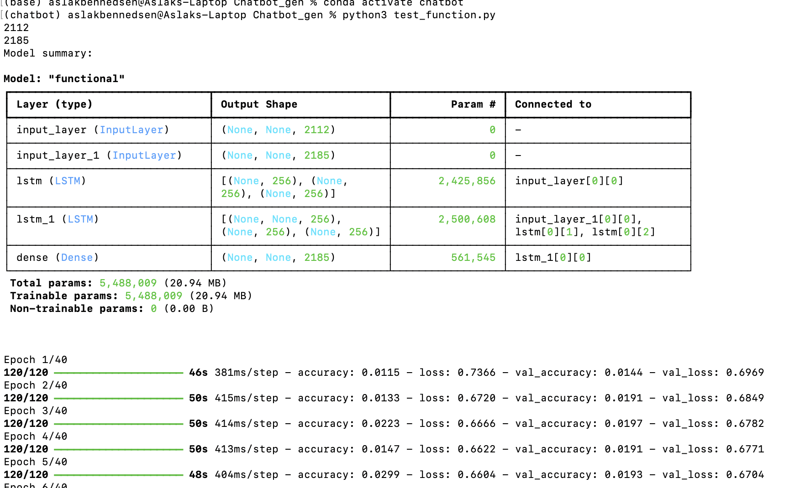
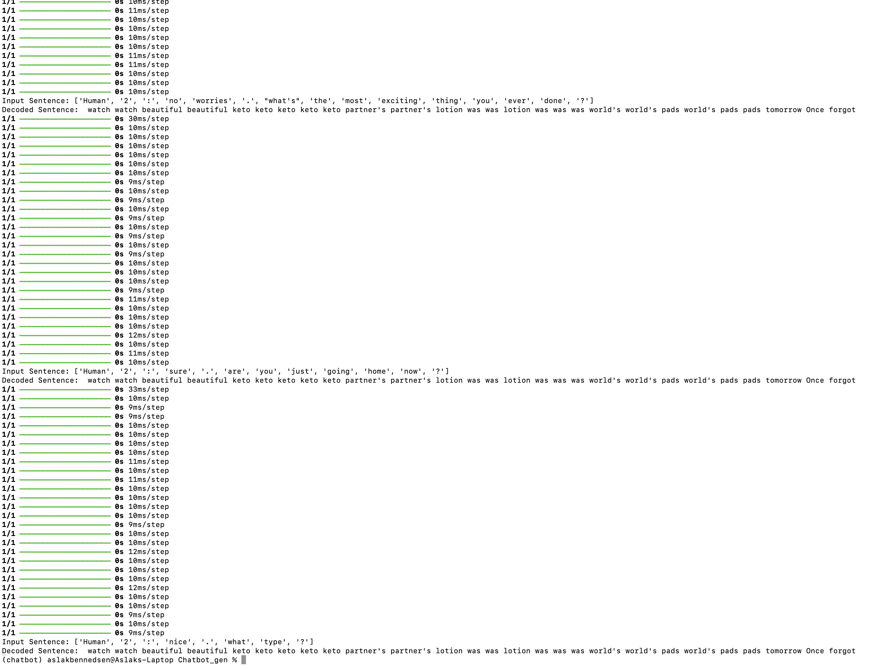
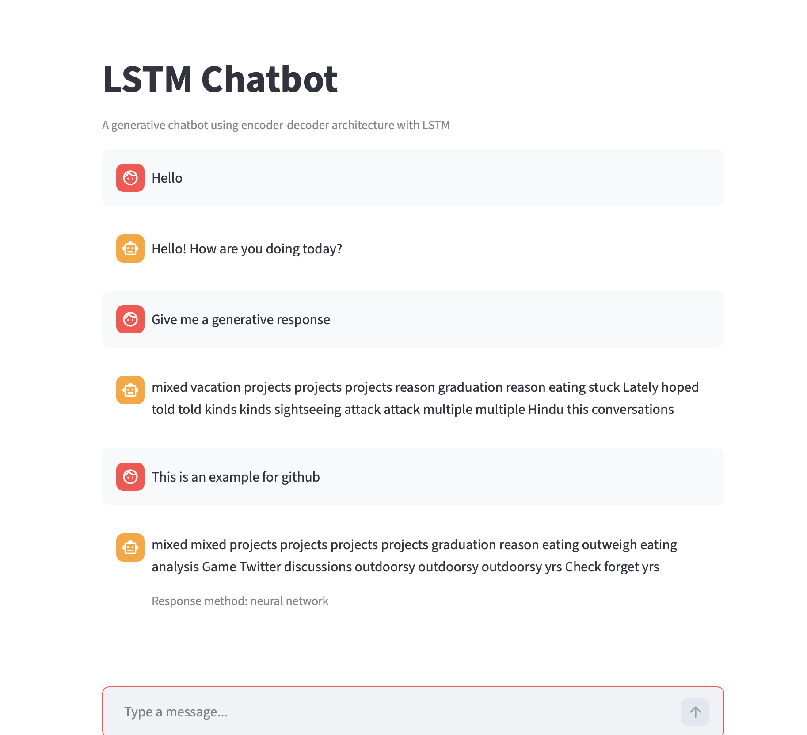

# Capstone Project - Aslak2322

## Generative Chatbot with rule based filter
I decided on a open based chatbot, as this seemed the most interesting to code. I then added a rule based filter, to check basic responses, and answer in a rule based way if possible, and then calling the generative part of the chatbot as a fallback.

## Use Cases
A conversation chatbot, that attempts to mimic human responses. 

## Techniques
 - A lstm memory neural network was used to train the model. It is also used when responding to an input, as the input is fed through the lstm-nn to predict the best answer to the provided input. It is only trained on a file of human-chat data.
 - Classic decoder/encoder architecture
 - Preprocessing of data based on the human 1/ human 2 label in the data
 - Streamlit for interface

## Reflection on process
I started out wanting to scrape reddit or twitter for data, but as the reddit api is restricted now, they denied my app request. The twitter API is expensive, and i therefore ended up training the model on a simple human-chat dataset. I had already created a similar generative chatbot, building it was just modifying that chatbot with a new way to loop over the training data. I learned all the intricacies of this pipeline, when creating this chatbot, but it is still a simple chatbot, that would need more training data to function well. I also do not have the time to wait for the neural network to train for 4 hours, so i trained it once, and accepted a semi-functional chatbot in the end, knowing that i still learned all the important aspects of this project.
### Ethical concerns
As the chatbot mimics a human conversation, it is important that the user understands it is not chatting with a human. Issues could also arise, where it would generate hateful or inappropriate responses, or even responses that would inform the user on how to do various criminal or malicious activities. Constraints would need to be put in place to make sure that the chatbot does not output these kind of responses, or that it does not respond to malicious requests. This could be done with if else statements, but it is outside the scope of this project.

## Dependencies and dataset
### Dataset
https://www.kaggle.com/datasets/projjal1/human-conversation-training-data?resource=download

### Dependencies
- numpy
- re
- tensorflow
- keras
- streamlit

## Images

